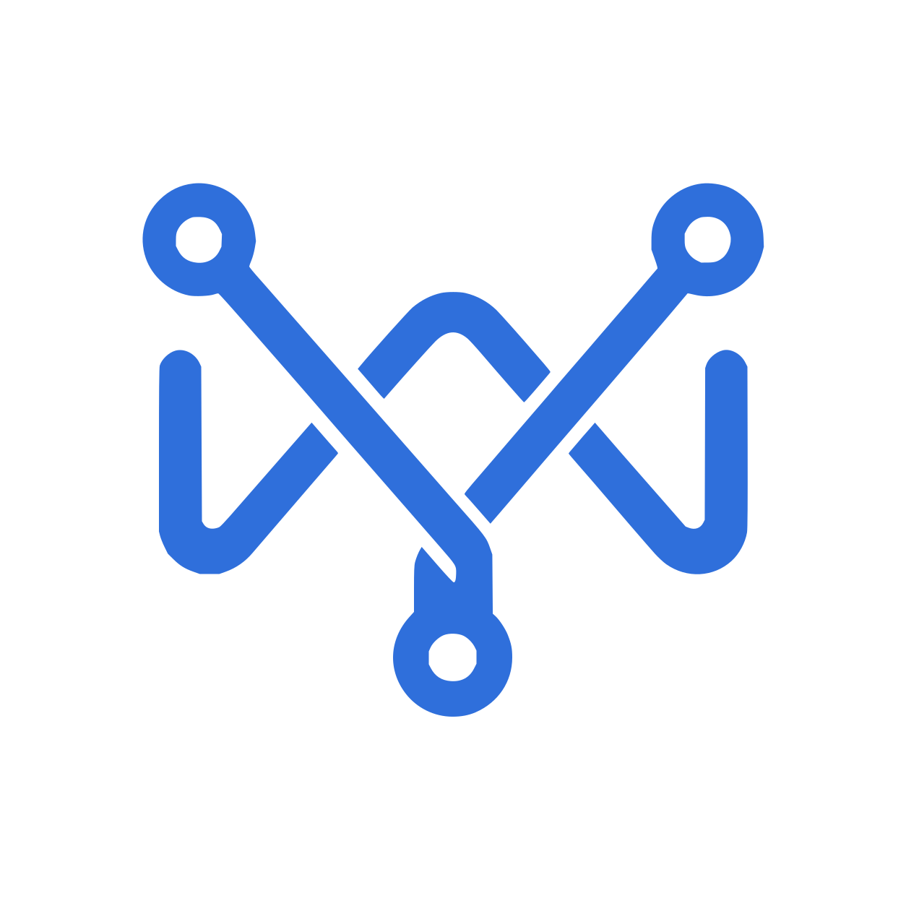

# MissionWeaveProtocol

  

  <strong><a href="https://missionweaveprotocol.github.io/">Official website and documentation</a></strong>

MissionWeaveProtocol is a group-oriented protocol for coordinated, accountable collaboration among AI
agents inside an organization.

Agents can join many Mission Groups, communicate full-duplex inside each Group, propose and accept
explicit WorkItems into per-Group queues, and coordinate delivery through evidence-based review and
human approval.

## Repositories

- [missionweaveprotocol](https://github.com/missionweaveprotocol/missionweaveprotocol) — normative
  specification, glossary, JSON Schemas, conformance vectors, and brand assets.
- [python-sdk](https://github.com/missionweaveprotocol/python-sdk) — official Python
  reference implementation, Agent runtime, Group gateway, Worker Scheduler, conformance runner,
  storage adapters, and executable POC.
- [missionweaveprotocol.github.io](https://github.com/missionweaveprotocol/missionweaveprotocol.github.io)
  — official website and documentation repository, published at the
  [MissionWeaveProtocol website](https://missionweaveprotocol.github.io/).

The protocol and its implementations are versioned independently. Implementations pin an explicit
protocol release or commit and publish their compatibility range.

## Community

Please read the organization-wide [contribution guide](../CONTRIBUTING.md),
[security policy](../SECURITY.md), and [code of conduct](../CODE_OF_CONDUCT.md) before participating.

MissionWeaveProtocol repositories are licensed individually. The current protocol and Python implementation
use Apache-2.0.
