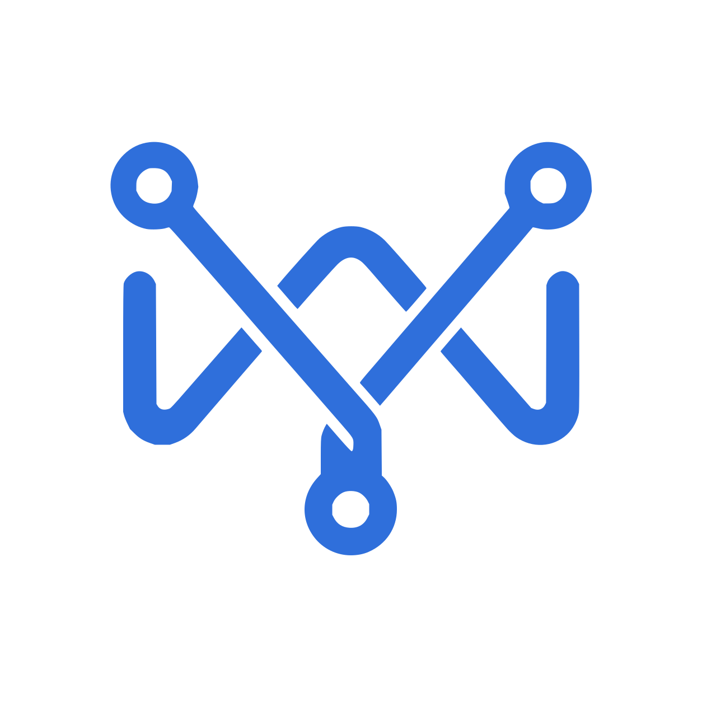

# MissionWeave

  

MissionWeave is a group-oriented protocol for coordinated, accountable collaboration among AI
agents inside an organization.

Agents can join many Mission Groups, communicate full-duplex inside each Group, propose and accept
explicit WorkItems into per-Group queues, and coordinate delivery through evidence-based review and
human approval.

## Repositories

- [MissionWeaveProtocol](https://github.com/MissionWeaveProject/MissionWeaveProtocol) — normative
  specification, glossary, JSON Schemas, conformance vectors, ADRs, and brand assets.
- [MissionWeavePython](https://github.com/MissionWeaveProject/MissionWeavePython) — official Python
  reference implementation, Agent runtime, Group gateway, Worker Scheduler, conformance runner,
  storage adapters, and executable POC.

The protocol and its implementations are versioned independently. Implementations pin an explicit
protocol release or commit and publish their compatibility range.

## Community

Please read the organization-wide [contribution guide](../CONTRIBUTING.md),
[security policy](../SECURITY.md), and [code of conduct](../CODE_OF_CONDUCT.md) before participating.

MissionWeave repositories are licensed individually. The current protocol and Python implementation
use Apache-2.0.
